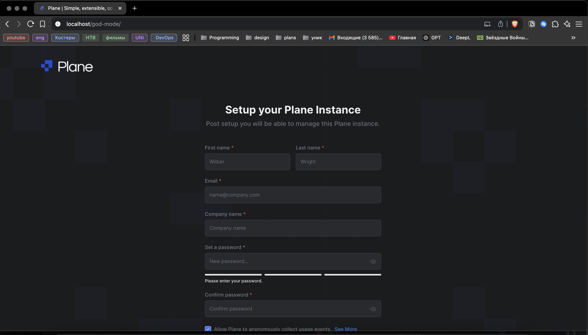

# Развертывание приложения plane в локальной среде

```
Для деплоя используем готовый docker-compose файл который находиться в корне репозитория
```

# Пошаговая инструкция:

1. Клонируем репозиторий для клонирования используем ```git clone```. Полная команда:

    ```
    git clone https://github.com/makeplane/plane.git
    ```

2. Далее добавляем сами или меняем название текущего **env** файла с ```.env.example``` на просто ```.env```. В проекте присутствуют два **.env** файла.

    ***Env файл находится в корне проекта и в директории ```apiserver```***


3. Добавляем в **.env** который находится в  ```{PROJECT}/apiserver/.env``` файл ```SECRET_KEY```
его можно сгенерировать с помощью команды ```openssl``` или ввести произвольные символы.

4. Теперь запускаем docker compose файл из корня проекта. Воспользуемся командой:

    ```
    docker compose up --build -d
    ```
5. Ждем несколько минут пока поднимутся все контейнеры (контейреры можно проверить с помощью команды ```docker ps```).

6. Когда удостоверились, что все поднялось, можно пробывать подключится через браузер по http://localhost:80

### Результат который должен получится
